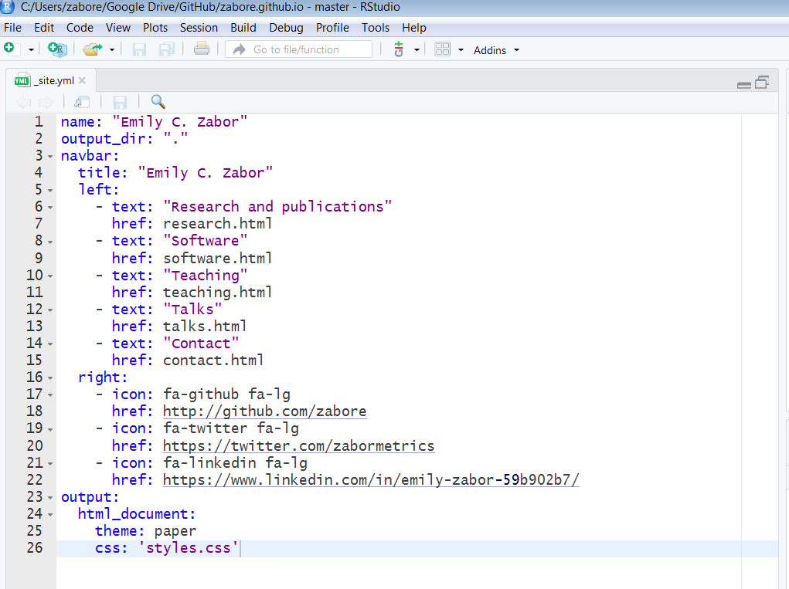
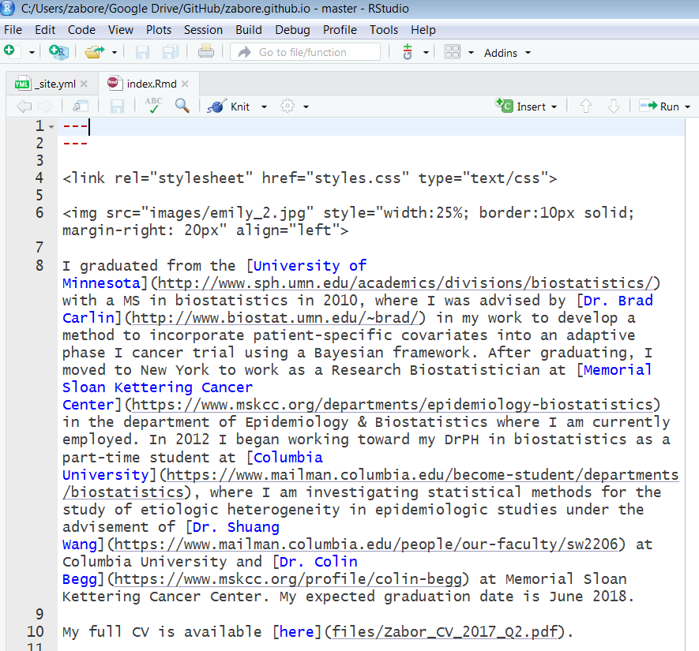

This tutorial provides an introduction to creating websites using R Markdown and GitHub pages. There are many ways to do this, and this tutorial shows you just one simple approach.

This tutorial was originally presented at the Memorial Sloan Kettering Cancer Center Department of Epidemiology and Biostatistics R User Group meeting on January 23, 2018.

## GitHub

If you don't have a GitHub account already, sign up for one at [https://github.com/join?source=header-home](https://github.com/join?source=header-home).

## Types of websites

The main types of websites you may want to create include:

1. Personal website
2. Package website
3. Project website


## R Markdown website basics

The minimum requirements for an R Markdown website are:

- `index.Rmd`: contains the content for the website homepage
- `_site.yml`: contains metadata for the website

You can find an overview of R Markdown website basics [here](http://rmarkdown.rstudio.com/rmarkdown_websites.html).

Examples to follow.


## Personal websites

An example from the homepage of  [my personal website](www.emilyzabor.com):


There are two main steps for creating a personal website that will be hosted on GitHub:

1. Local setup
2. GitHub setup


### Local setup

1. Create a local directory named YOUR_GH_NAME.github.io
2. Add an R Project to this directoroy
3. Create a `_site.yml` and `index.Rmd` file in your new directory


### Why do I need an R Project?

The R Project is important because RStudio will recognize your project as a website, and provide appropriate build tools.


### Create content

Edit the `_site.yml` file to change the metadata, layout, and  [theme](http://jekyllthemes.org/) of your website. 



Edit and create `.Rmd` files that contain your website content, which will produce the html pages of your website when you knit them.



On the Build tab in RStudio, select "Build Website":


Now your directory contains all of the files needed for your website:


### GitHub setup

1. Create a GitHub repository named YOUR_GH_NAME.github.io
2. Initialize it with a README


### Deploy website

- Select "Upload files" from the main page of your GitHub repo:


- And simply drag or select the files from the local repository:


- Alternatively, us Git from the shell, from a Git client, or from within RStudio (another great reason to use an R Project!)


But this is not a Git/GitHub tutorial. If you want to learn more, here's a great resource to get you started: [http://happygitwithr.com/](http://happygitwithr.com/)


## Package website


Use Hadley Wickham's great package `pkgdown` to easily build a website from your package. Details of `pkgdown` can be found on [the pkgdown website](http://hadley.github.io/pkgdown/), which was created using `pkgdown`.

From within your package directory run: 

```{r eval = FALSE}
devtools::install_github("hadley/pkgdown")
pkgdown::build_site()
```

- This will add a folder called docs to the directory for your package. 

- Upload/push these changes to the GitHub repository for your package

- In the Settings of the GitHub repo for your package, under GitHub pages, select "master branch/docs folder" as the source:


- The page will be added as to the page: YOUR_GH_NAME.github.io/repo_name


## Project website

You can create a website for a non-package repository as well. For example, I could add a page to my website linking for the repository in which this tutorial is stored.


### Local setup

From within the local directory of the project of interest:

1. Create a `_site.yml` and `index.Rmd` file in your new directory
2. Edit these files to create content and manage layout, as before for personal websites


### GitHub setup

- Upload/push these new files to the GitHub repository for your project

- Enable GitHub pages for the repository:


